# Projet Node-RED Dashboard

Ces instructions vous permettront de créer votre premier Dashboard Node-RED. Vous y trouverez toutes les étapes qui vous permettront d'obtenir une page web avec des données représentées sous forme de graph, texte, image, ou tout autre élément html, sans avoir à passer beaucoup de temps à coder.

Node-RED est un outil de programmation graphique basé sur un navigateur web. L'outil est lui même un projet Node, donc le language de programmation utilisé est le Javascript (HTML, CSS ..)

Node-RED est open source mais ici vous utiliserez une version que vous pourrez facilement déployer sur IBM Cloud. De cette façon, vous pourrez aussi intégrer des services IBM Cloud facilement dans votre code.

## Objectifs de l'exercice

+ Prendre en main l'outil Node-RED pour démarrer un nouveau projet
+ Mettre en application les méthodes AGILE apprises tout au long du cours
+ Etendre votre projet techniquement: imaginer des évolutions et les concrétiser à l'aide d'outils et de services Cloud disponibles par exemple


## Pre-Requis

+ Un [compte IBM Cloud](https://cloud.ibm.com/registration)

## Etapes

1. [Créer votre première application Node-RED](#etape-1---Nodered)
2. [Ajouter la librairie Dashboard](#etape-2---Librairie)
3. [Importer du starter code](#etape-3---Starter-code)
4. [Aide et Recommandations](#Recommandations)


# Etape 1 - Nodered

1. Connectez vous à https://cloud.ibm.com/login
1. Naviguez dans le catalogue https://cloud.ibm.com/catalog
et choisissez **Software** depuis le menu à gauche. Recherchez "Node-RED App"
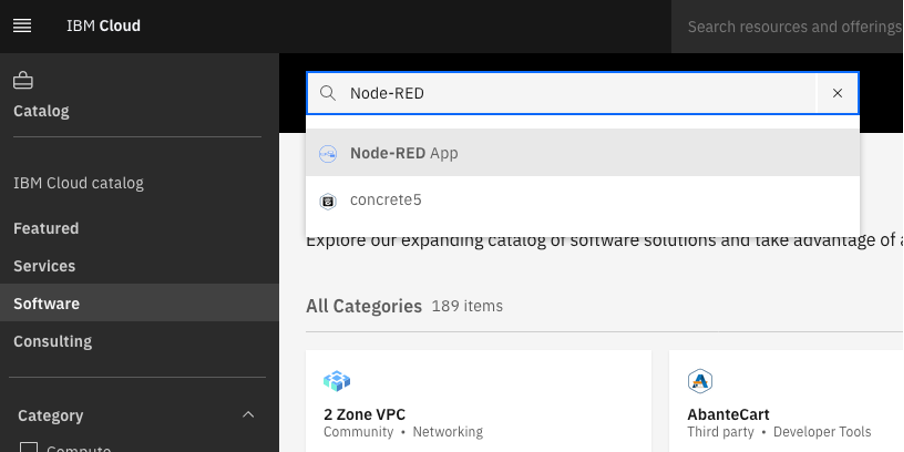

1. Sélectionnez l'onglet **Create**. Donnez un nom à votre application.
1. Node-RED utilise une base de données Cloudant. Dans le menu déroulant **Pricing plan** , vous pouvez soit choisir d'utiliser un service Cloudant existant soit en créer un nouveau si vous n'en avez jamais instancié auparavant (vous n'avez le droit qu'à une seule instance avec un compte Lite)
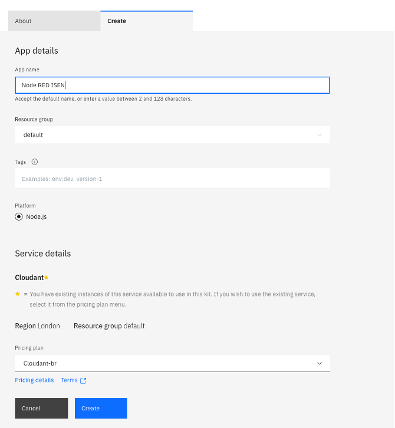

1. Cliquez **Create**
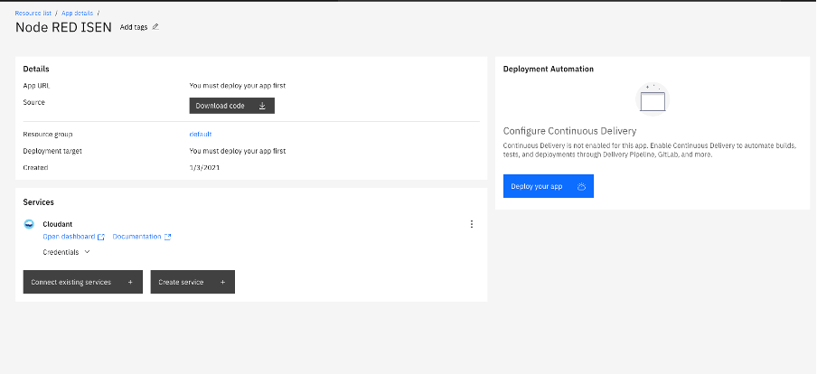

1. Il vous faut ensuite déployer cette application. Cliquez sur le bouton **Deploy your app**

1. Choisissez l'option **Cloud Foundry** et générez une nouvelle clé d'API pour le déploiement.
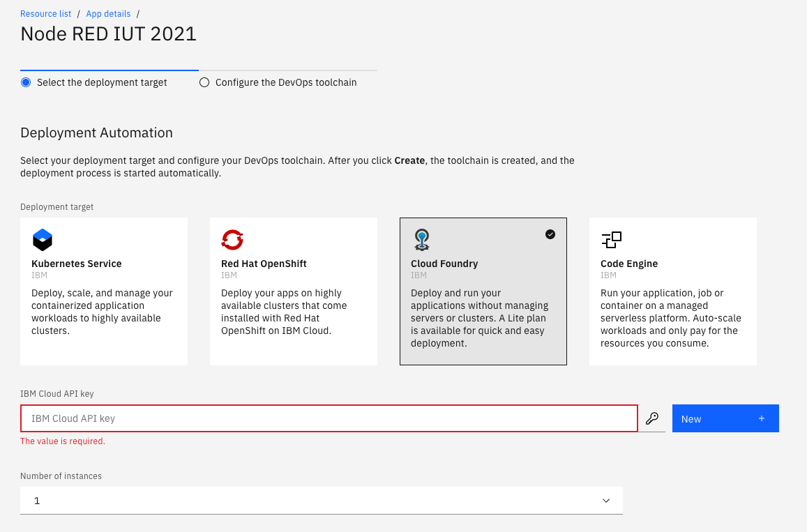
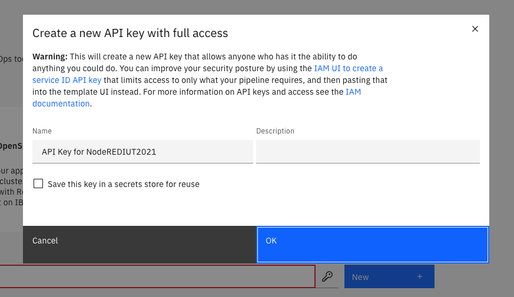

1. Cliquez **Next**
1. Cliquez **Create**

1. Pendant quelques minutes l'application se déploie en initialisant une chaîne DevOps (outils DevOps de développement pour gérer le Build and Deploy de l'application). Dans cet exercice, nous laisserons de côté cet aspect DevOps de l'application, mais il faut attendre que la chaîne soit activée.

1. Notez que vous pouvez suivre le status de la création dans l'encart **Deployment automation** en cliquant sur **Status**
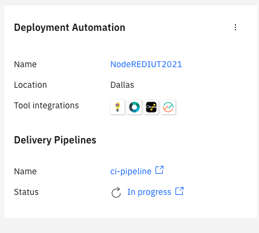
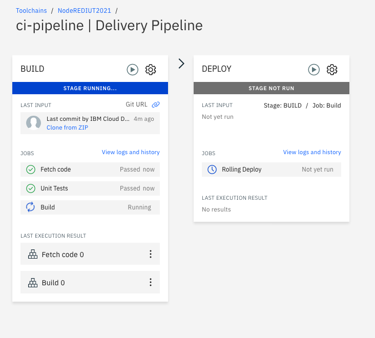

1. Quand l'application est déployée, cliquez sur le l'**App url** pour l'ouvrir:
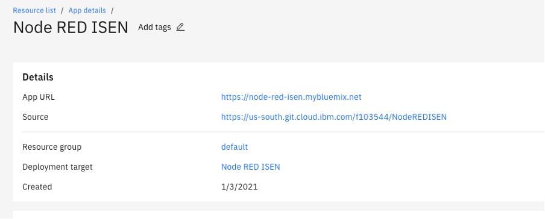

1. La première fois que vous accédez à votre application après avoir cliqué sur le bouton rouge "Go to your Node-Red editor", il vous est demandé de sécuriser votre application. Vous pouvez le faire en ajoutant un username et un password. Conservez ces informations.
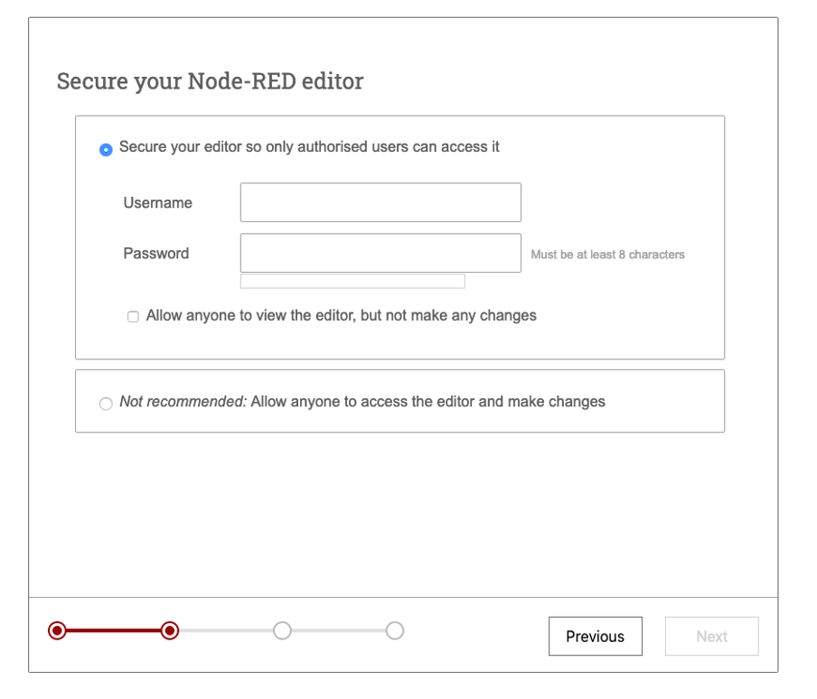

1. Cliquez **Next** et accédez à votre éditeur Node-RED.
L'éditeur s'ouvre avec un flow par défaut:
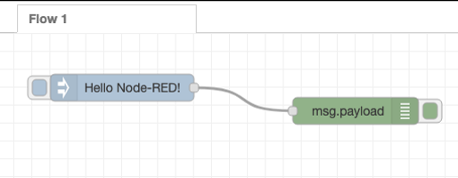

1. Pour tester ce flow, il vous suffit de cliquet sur le bouton à gauche du noeud bleu "Hello Node-RED!" et de visualiser le résultat dans la console de debug sur la droite.
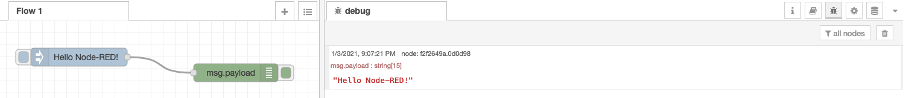

1. Vous l'avez compris, le noeud bleu de type "inject" sert de source de donnée et le noeud vert de type "debug" correspond à un traçage ou à un log dans votre code. N'hésitez pas à utiliser ce type de noeuds pour simuler des entrées de données et à tracer dans la console pour tester votre code.

# Etape 2 - Librairie

Dans cette partie de l'exercice, vous allez apprendre à importer de nouvelles librairies sous Node-RED (librairies NPM).
Pour le projet, vous pourriez avoir besoin par exemple de créer une interface graphique représentant certaines données.

Ici nous allons importer dans l'environment Node-RED la librairie "node-red-dashboard". Cette librairie permet de créer des dashboards avec des graphiques, du text, des images etc ...

1. Depuis le menu, en haut à droite de votre éditeur Node-RED, choisissez **Manage palette**
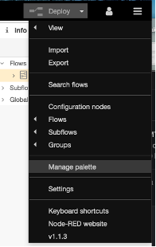

1. Dans l'ongle **Install** faites une recherche de la librairie **node-red-dashboard** puis cliquez sur **install**
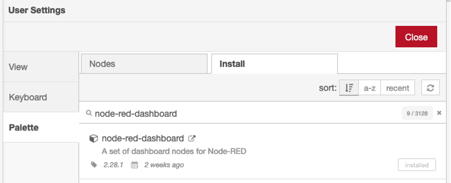

1. Une fois l'installation terminée, vous pouvez notez qu'une nouvelle famille de nodes a été installées dans la boite à outils à gauche de votre éditeur:
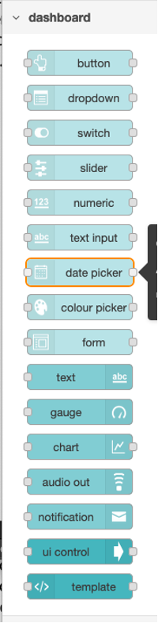

  Vous allez aussi ajouter la librairie **play-audio** qui vous permettra de jouer du son dans votre navigateur.
1. Depuis le menu, en haut à droite de votre éditeur Node-RED, choisissez **Manage palette**

1. Dans l'ongle **Install** faites une recherche de la librairie **node-red-contrib-play-audio** puis cliquez sur **install**
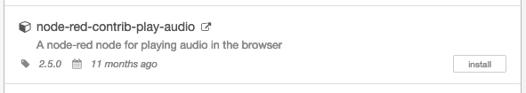

# Etape 3 - Starter code

Dans cette partie de l'exercice, vous allez importer du code source dans votre éditeur Node-RED pour que vous disposiez d'un exemple de dashboard dans Node-RED.

1. Depuis le menu en haut à droite de votre éditeur, cliquez sur **Import** et copier coller le flow json si dessous ou importez le sous forme de fichier.
```
[{"id":"cb7d8923.5ce1","type":"function","z":"a060d358.5d3ae","name":"capteurs de température","func":"// Thermostat's location:\nvar longitude1 = -98.49;\nvar latitude1 = 29.42;\n\n// Array of pseudo random temperatures\nvar sensor42 = [9,10,11.5,14,16,12,11,10,12.5,11.5];  // plafond\n\n// Array of pseudo random temperatures\nvar sensor255 = [52,55,61,68,65,60,53,52,51,47];  //sol\n\n// Array of pseudo random temperatures\nvar sensor404 = [15,17,18.5,20,21.5,23,24,22.2,19,18]; //int\n\n// Array of pseudo random temperatures\nvar sensor8086 = [25,22,26,21,19,22.5,21,23,25,18]; //ext\n\n\n\n// Counter to select from array.\nvar counter1 = context.get('counter1')||0;\ncounter1 = counter1+1;\nif(counter1 > 9) counter1 = 0;\ncontext.set('counter1',counter1);\n\n// Create MQTT message in JSON\nmsg = {\n  payload: JSON.stringify(\n    {\n      d:{\n        \"sensor42\" : sensor42[counter1],\n        \"sensor404\" : sensor404[counter1],\n        \"sensor255\" : sensor255[counter1],\n        \"sensor8086\" : sensor8086[counter1],\n        \"location\" :\n        {\n          \"longitude\" : longitude1,\n          \"latitude\" : latitude1\n        },\n      }\n    }\n  )\n};\nreturn msg;\n","outputs":1,"noerr":0,"initialize":"","finalize":"","x":330,"y":140,"wires":[["d0630991.e8eec8"]]},{"id":"4e7dddf2.5fc48c","type":"inject","z":"a060d358.5d3ae","name":"Send Data","props":[{"p":"payload"},{"p":"topic","vt":"str"}],"repeat":"3","crontab":"","once":false,"onceDelay":"","topic":"","payload":"true","payloadType":"bool","x":130,"y":140,"wires":[["cb7d8923.5ce1"]]},{"id":"d0630991.e8eec8","type":"json","z":"a060d358.5d3ae","name":"","property":"payload","action":"","pretty":false,"x":530,"y":140,"wires":[["1f78df55.2e8491","af2606ca.d12b88"]]},{"id":"98fc0088.09937","type":"comment","z":"a060d358.5d3ae","name":"Simulateur de capteurs (en boucle si activé)","info":"","x":210,"y":100,"wires":[]},{"id":"1f78df55.2e8491","type":"change","z":"a060d358.5d3ae","name":"","rules":[{"t":"set","p":"payload","pt":"msg","to":"payload.d.sensor255","tot":"msg"}],"action":"","property":"","from":"","to":"","reg":false,"x":720,"y":120,"wires":[["223ee4da.46dbb4"]]},{"id":"223ee4da.46dbb4","type":"ui_gauge","z":"a060d358.5d3ae","name":"","group":"b5d599d0.e0cd5","order":1,"width":"5","height":"5","gtype":"gage","title":"T° Sol","label":"°C","format":"{{value}}","min":0,"max":"80","colors":["#0016b5","#7c0c7c","#ca3838"],"seg1":"","seg2":"","x":890,"y":120,"wires":[]},{"id":"af2606ca.d12b88","type":"change","z":"a060d358.5d3ae","name":"","rules":[{"t":"set","p":"payload","pt":"msg","to":"payload.d.sensor42","tot":"msg"}],"action":"","property":"","from":"","to":"","reg":false,"x":720,"y":160,"wires":[["de86e4a5.fc279","cc2ebc24.1aab68"]]},{"id":"de86e4a5.fc279","type":"ui_gauge","z":"a060d358.5d3ae","name":"","group":"b5d599d0.e0cd5","order":2,"width":"5","height":"5","gtype":"gage","title":"T° Plafond","label":"°C","format":"{{value}}","min":0,"max":"30","colors":["#0016b5","#7c0c7c","#ca3838"],"seg1":"","seg2":"","x":910,"y":160,"wires":[]},{"id":"cc2ebc24.1aab68","type":"switch","z":"a060d358.5d3ae","name":"","property":"payload","propertyType":"msg","rules":[{"t":"gt","v":"15","vt":"num"},{"t":"else"}],"checkall":"true","repair":false,"outputs":2,"x":770,"y":340,"wires":[["6e92b595.ccc21c"],["af65aa1b.5bcc38"]]},{"id":"6e92b595.ccc21c","type":"change","z":"a060d358.5d3ae","name":"","rules":[{"t":"set","p":"payload","pt":"msg","to":"ALERTE!","tot":"str"}],"action":"","property":"","from":"","to":"","reg":false,"x":960,"y":300,"wires":[["14d507f2.ca9f9","764de72f.6c4f9"]]},{"id":"af65aa1b.5bcc38","type":"change","z":"a060d358.5d3ae","name":"","rules":[{"t":"set","p":"payload","pt":"msg","to":"","tot":"str"}],"action":"","property":"","from":"","to":"","reg":false,"x":960,"y":360,"wires":[["14d507f2.ca9f9"]]},{"id":"14d507f2.ca9f9","type":"ui_text","z":"a060d358.5d3ae","group":"b5d599d0.e0cd5","order":3,"width":"14","height":"2","name":"ALERT","label":"","format":"<font color=\"red\" size=\"40\">{{msg.payload}}</font>","layout":"row-left","x":1180,"y":360,"wires":[]},{"id":"764de72f.6c4f9","type":"http request","z":"a060d358.5d3ae","name":"Get alarm sound","method":"GET","ret":"bin","url":"http://static1.grsites.com/archive/sounds/emergency/emergency030.wav","tls":"","x":1210,"y":300,"wires":[["66b0ec16.4e83b4"]]},{"id":"66b0ec16.4e83b4","type":"play audio","z":"a060d358.5d3ae","name":"","voice":"","x":1430,"y":300,"wires":[]},{"id":"851da2fc.feda38","type":"comment","z":"a060d358.5d3ae","name":"Alerte lorsque la température du plafond > 15","info":"","x":1070,"y":260,"wires":[]},{"id":"801ca3a4.3ed7a","type":"ui_button","z":"a060d358.5d3ae","name":"","group":"a2fba279.0eda18","order":2,"width":0,"height":0,"passthru":false,"label":"World","tooltip":"","color":"","bgcolor":"","icon":"","payload":"World","payloadType":"str","topic":"","x":90,"y":280,"wires":[["cacefd56.97f338"]]},{"id":"cacefd56.97f338","type":"ui_text","z":"a060d358.5d3ae","group":"a2fba279.0eda18","order":3,"width":"0","height":"0","name":"","label":"Résultat:","format":"{{msg.payload}}","layout":"row-spread","x":250,"y":260,"wires":[]},{"id":"e8f48553.950a","type":"ui_button","z":"a060d358.5d3ae","name":"","group":"a2fba279.0eda18","order":1,"width":0,"height":0,"passthru":false,"label":"Hello","tooltip":"","color":"","bgcolor":"","icon":"","payload":"Hello","payloadType":"str","topic":"","x":90,"y":240,"wires":[["cacefd56.97f338"]]},{"id":"5ed4063e.760b38","type":"ui_template","z":"a060d358.5d3ae","group":"a2fba279.0eda18","name":"Template HTML","order":4,"width":"13","height":"17","format":"<canvas id=\"myCanvas\"></canvas>\nRapport: Page HTML créée avec: {{msg.payload}}\n\n\n<script type=\"text/javascript\">\n</script>","storeOutMessages":false,"fwdInMessages":false,"resendOnRefresh":false,"templateScope":"local","x":380,"y":340,"wires":[[]]},{"id":"ea4b2f90.2ecd4","type":"inject","z":"a060d358.5d3ae","name":"","props":[{"p":"payload"},{"p":"photo","v":"https://avatars.githubusercontent.com/u/5375661?s=280&v=4","vt":"str"}],"repeat":"1","crontab":"","once":false,"onceDelay":0.1,"topic":"","payload":"Node-RED","payloadType":"str","x":140,"y":340,"wires":[["5ed4063e.760b38"]]},{"id":"b5d599d0.e0cd5","type":"ui_group","z":"","name":"Default","tab":"cd59c761.f2f9f","order":1,"disp":false,"width":"20","collapse":false},{"id":"a2fba279.0eda18","type":"ui_group","z":"","name":"Rapport","tab":"8207ec55.93e5d8","order":1,"disp":true,"width":"13","collapse":false},{"id":"cd59c761.f2f9f","type":"ui_tab","z":"","name":"Dashboard","icon":"dashboard","disabled":false,"hidden":false},{"id":"8207ec55.93e5d8","type":"ui_tab","z":"","name":"Home","icon":"dashboard","disabled":false,"hidden":false}]
```

Ce starter code vous servira de base pour le projet, il montre comment manipuler certains composants node-red dashboard par exemple.

# Aide et Recommandations


**Bien utiliser Node-RED**

1. Utilisez les noeuds "Inject" et "Debug"
1. Utilisez l'onglet "Info" quand vous sélectionnez un noeuds pour savoir comment il fonctionne (entrée, sortie, paramètres..)
1. L'onglet Dashboard vous permet de personaliser votre UI et de compartimenter les onglets de votre page web
1. N'hésitez pas à utiliser d'autres noeuds de la boite à outils  ou importer des librairies (attention c'est de l'open source, lisez bien la doc avant). Vous pouvez aussi importer des flows existants, disponibles dans la librairie.
1. Librairies node-red: https://flows.nodered.org/
